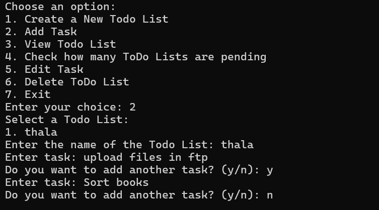

<h1 align="center">To-Do List Application</h1>

<p align="center">
  
</p>

<p align="center">
  <b>A simple command-line based To-Do List application written in C.</b>
</p>

## 1. Description

This application allows users to create, manage, and organize their tasks in different to-do lists. Users can perform various operations such as adding tasks, marking tasks as complete, viewing tasks, and removing to-do lists.

## 2. Features

- **Create Todo List**: Users can create new to-do lists with a specified name.
- **Add Tasks**: Users can add tasks to their selected to-do list.
- **View Tasks**: Users can view the tasks in their selected to-do list.
- **Mark Tasks as Complete**: Users can mark tasks as complete in their selected to-do list.
- **Remove Todo List**: Users can delete a specified to-do list along with its tasks.

## 3. Usage

To compile the application, run the following command:

```bash 
gcc main.c todolist.c -o main
```

To run the application, execute the compiled binary:
```bash
main.exe
```


Follow the on-screen instructions to navigate through the application.
- **Step 1** Navigate to the file directory where the sources folder is located, you can do this by copying the file path of the sources and running this command in the terminal ```cd "[your file path]"```
- **Step 2** you can list out the files present in the current directory by running the following command "dir" if a main.exe file is not present then create it by running the ```gcc main.c todolist.c -o main```
- **Step 3** Once the main.exe file is created you can run it by running this command ```main.exe```
- **Step 4** You should now be prompted with a screen containing the options for the ToDo List <p align="left">  </p>
- **Step 5** For file creation enter 1. Enter the name for the file without any extensions(.md,.exe,.txt etc...) and press enter <p align="left">  </p>. You would now have received an output like this 
```List of todo lists saved in 'todo_lists.txt'. ```
```thala.md``` 
```Number of todo lists: 1```
- **Step 6** You should now be prompted with a screen containing the options for the next command, press 2 and enter the name of the todo list (**wihout extension**). The program will ask for the task to be entered. Enter your task, to enter additional tasks type y/Y else type n/N. <p align="left">  </p> 
- **Step 7** To view a todo list, press 3 once again type the name of the todo list (**wihout extension**). The program will output the contents of the todo list. <p align="left">  </p> . The empty check box [ ] indicates the task is not completed.
- **Step 8** To check how many todo lists are pending enter 4 <p align="left">  </p>
- **Step 9** To edit a task enter 5, type the name of the todo list (**wihout extension**). The program will display the first task and ask whether the task needs to be marked completed or not enter y/Y to mark it complete or press n/N to continue. If a task is completed the program will change the empty check box [ ] to a crossed one [X]. <p align="left">  </p>
- **Step 9** To delete todo List enter 6 type the name of the todo list (**wihout extension**). The file will be deleted from the directory as well as the ```todo_list.txt``` file <p align="left">  </p>
- **Step 10** To exit press 7. <p align="left">  </p>

## Important Points
The todo-list files only support markdown(.md) formatting.
The ```todo_list.txt``` file is important for the program to be able to function properly **do not attempt** to modify the contents of the ```todo_list.txt``` file.
Any modifications to the header file(```todo.h```) or source file (```todolist.c```) can relate  

## Attributions
"Icon made by Freepik from www.flaticon.com"

## Author
* [Nick](https://github.com/RuntimeConnoisseurs)

## License

This project is licensed under the [MIT License](https://opensource.org/license/mit).

